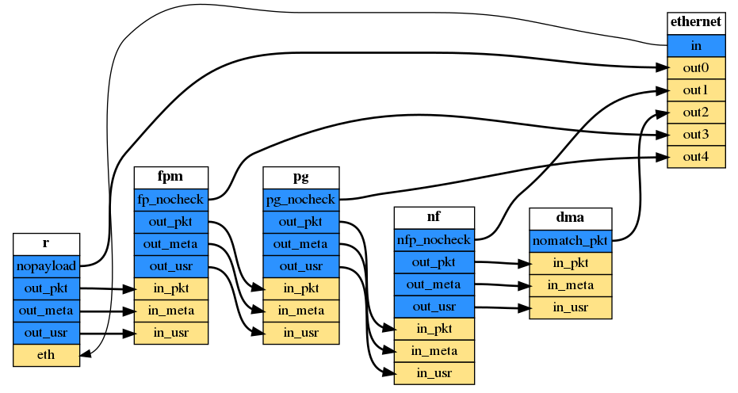

# FPGA2022 artifact submission (Pigasus 2.0 case study)

This repository contains the artifacts to be evaluated for FPGA2022 submission. In particular, we provide the hardware/software design and necessary scripts of the driving example (Pigasus 2.0) in our submission. 

Pigasus is an Intrusion Detection and Prevention System (IDS/IPS) that achieves 100Gbps using a single FPGA-equipped server. Pigasus's FPGA-first design ensures that most packets are processed entirely using the FPGA, while some packets are sent to the CPU for full evaluation. Compared with Pigasus 1.0, Pigasus 2.0 enables easy customization and more efficient scaling of Pigasus design. For more details, please see [Pigasus_Release](pigasus_release.md).

If you want to run Pigasus as it is, please go to `./pigasus` directly. 

## Customize Pigasus
Instructions on how to use the connection types and a short tutorial are available in the comments of `pigasus.py`. To use the single-FPGA Pigasus 2.0 design, run `./run_pigasus.sh`. To use the multi-FPGA version, run `./run_pigasus_multi.sh`.

Directory organization
* `run_pigasus.sh`: driver script for single-FPGA Pigasus. This is most likely the one you want to use.
* `run_pigasus_multi.sh`: driver script for multi-FPGA Pigasus.
* `pigasus`: contains the RTL code for single-FPGA Pigasus modules. See [Pigasus README](pigasus/README.md) for RTL simulation instructions.
* `pigasus_multi`: contains the RTL code for multi-FPGA Pigasus modules. See [Pigasus Multi README](pigasus_multi/README.md) for RTL simulation instructions.
* `pigasus.py`: Front end to drive Fluid for constructing Pigasus 2.0 designs. The comments in this file mention how to customize Pigasus 2.0.
* `pigasus_multi.py`: Front end to drive Fluid for constructing multi-FPGA Pigasus 2.0 designs. The structure of this file is similar to `pigasus.py`, therefore the documentation is the same and is only present in `pigasus.py`.
* `fluid`: contains a reduced version of Fluid for constructing Pigasus 2.0 designs.
    * `header.py`: main Fluid interface
    * `genericplatform.py`: platform-independent Fluid implementation (there are platform-dependent versions for OPAE and Xilinx Arty boards)
    * `parse_ast.py`: an internal representation of Verilog code as an AST in Python, for use in the generator.
    * `vtl.py`: Verilog Templating Language, a custom DSL for writing Verilog from Python code, used to quickly construct Verilog code snippets for the generator.
    * `visualizer.py`: Graphviz-based visualizer of the design generated by Fluid. For reasons yet unknown, the output of the visualizer is always a PNG file called `services.gv.pn`.
    * `services.py`: Fluid definitions of Pigasus modules. This is also good reference for constructing your own Fluid classes.
    * `connections.py`: Python functions wrapping the base connection type to make more complex connections, such as the auto clock-crossing ChannelFIFO used between Pigasus modules.
* `top_base.sv`, `top0_base.sv`, `top1_base.sv`: Some generic SystemVerilog code that needs to be pasted into the final generated design.

## License

Pigasus is developed at Carnegie Mellon University. The software component (`pigasus/software`) is adapted from Snort3 and released under the [GNU General Public License v2.0](software/LICENSE). The rest of the components including (`pigasus/hardware`,`pigasus_multi_fpga`,`fluid`) are released under the [BSD 3-Clause Clear License](hardware/LICENSE). 
